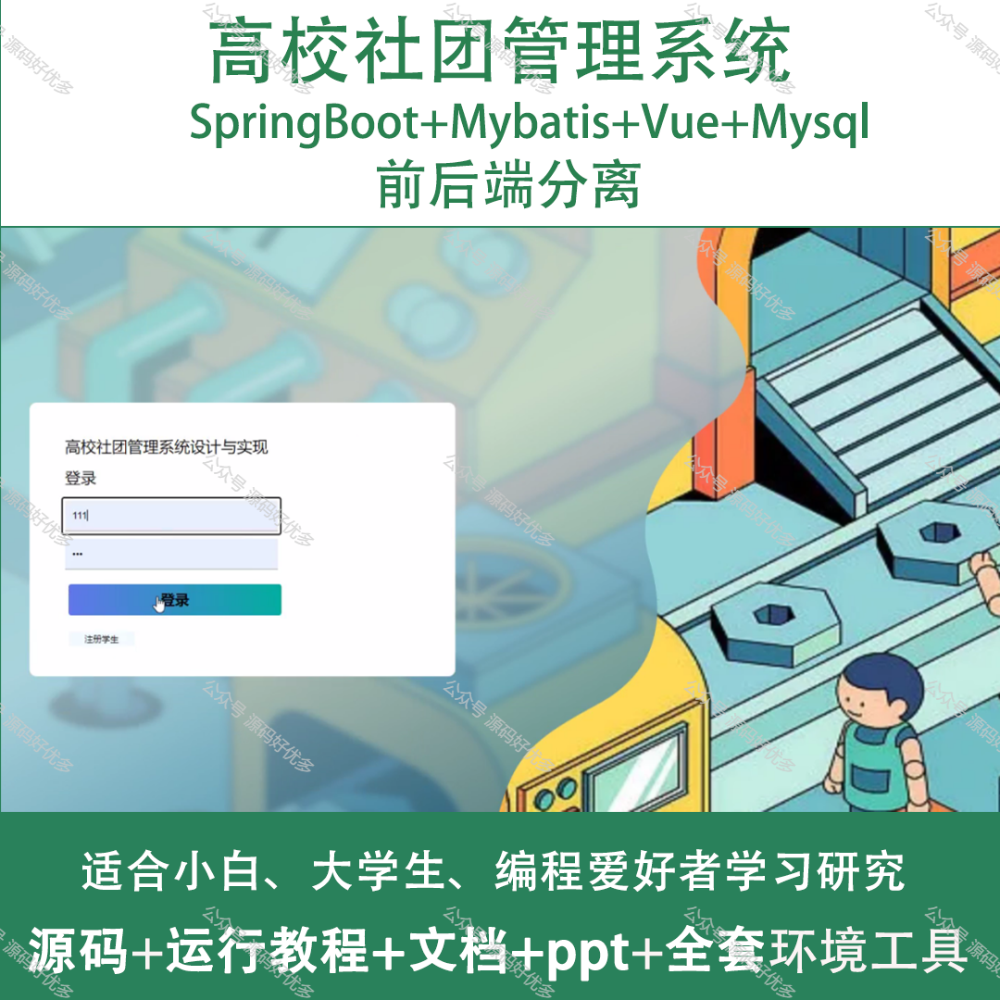
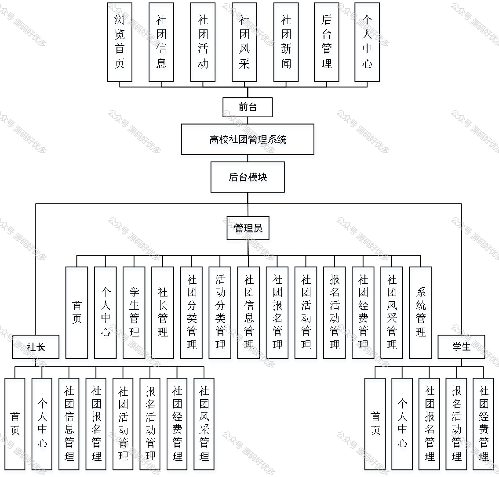
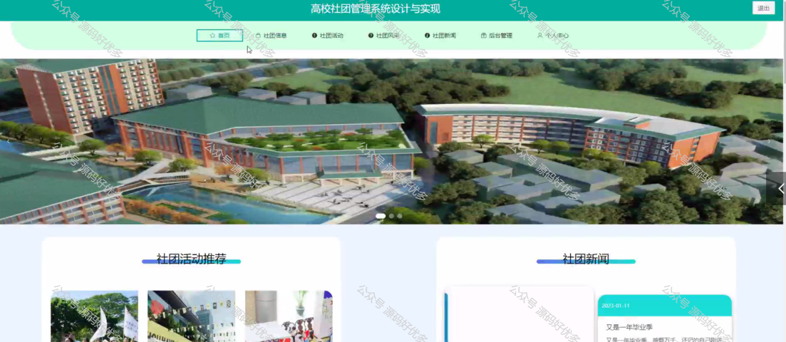
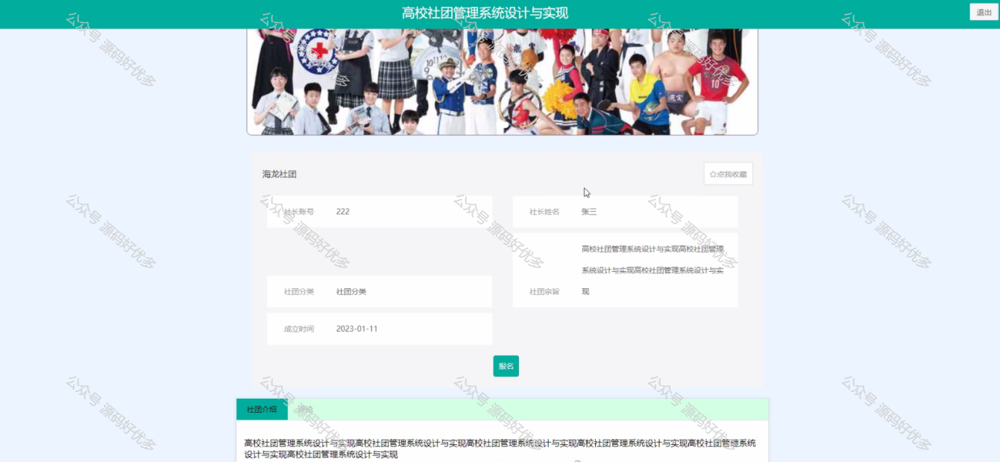
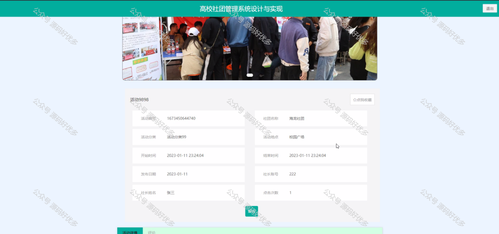
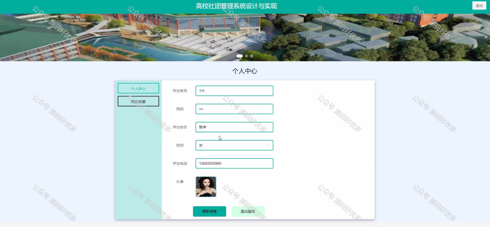
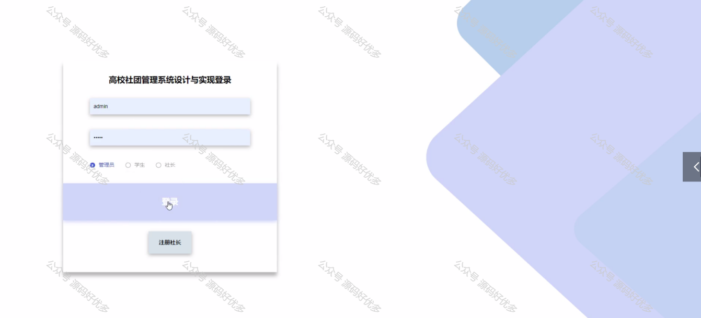
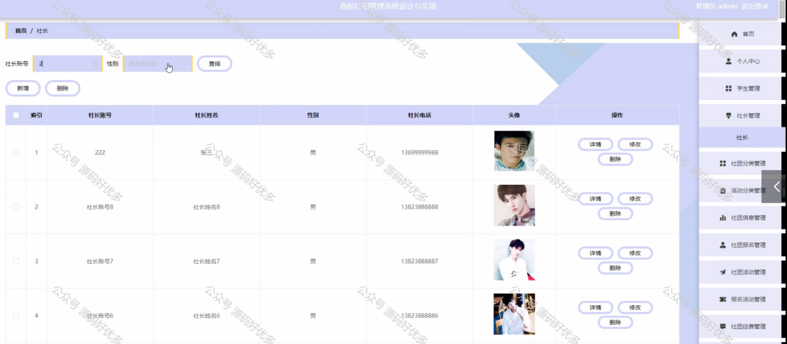
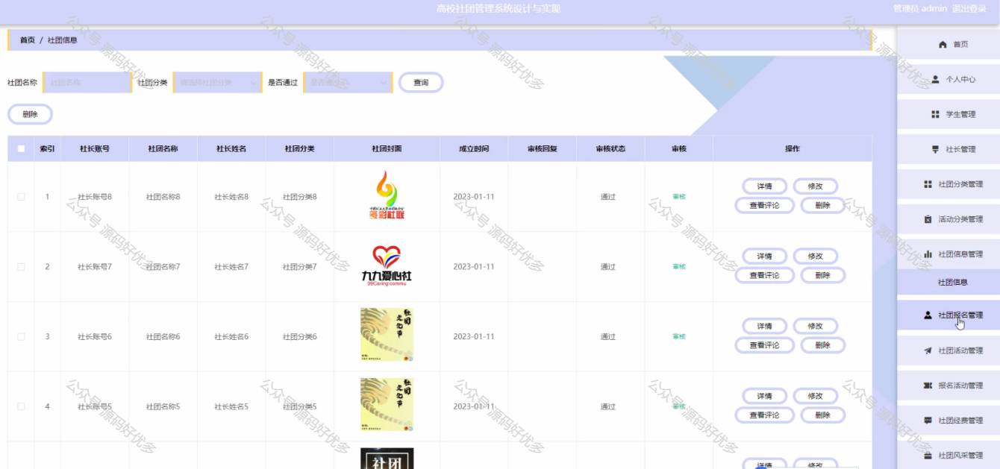
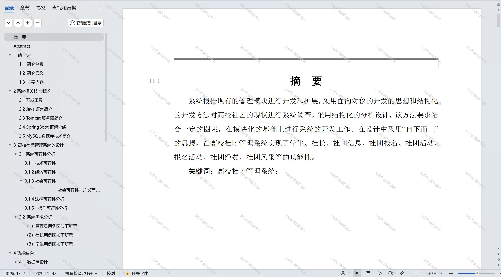

 
## 查看主页获取源码

### 一、作品包含

源码+数据库+设计文档万字+PPT+全套环境和工具资源+部署教程

### 二、项目技术

前端技术：Html、Css、Js、Vue、Element-ui

数据库：MySQL

后端技术：Java、Spring Boot、MyBatis

  

### 三、运行环境

开发工具：IDEA/eclipse

数据库：MySQL5.7

数据库管理工具：Navicat10以上版本

环境配置软件： JDK1.8+Maven3.6.3

前端Nodejs：14

### 四、项目介绍
项目编号：springbootA169

高校社团管理系统是为了更好地服务校园文化生活，提高学生社团的管理效率而开发的。该系统以校园为背景，紧密结合大学生社团的实际情况，旨在为社团成员提供一个便捷、高效的信息交流平台，同时为社团管理者提供一套完善的组织、协调、监督和评估工具，从而推动校园社团活动的有序开展，丰富学生的课余生活，培养学生的兴趣爱好和综合素质。

前台学生功能：浏览首页、社团信息、社团活动、社团风采、社团新闻、后台管理和个人中心。

后台分为管理员、学生、社长
管理员的功能：首页、个人中心、学生管理、社长管理、社团分类管理、活动分类管理、社团信息管理、社团报名管理、社团活动管理、报名活动管理、社团经费管理、社团风采管理、系统管理。
学生的功能：首页、个人中心、社团报名管理、报名活动管理和社团经费管理。
社长的功能：首页、个人中心、社团信息管理、社团报名管理、社团活动管理、报名活动管理、社团经费管理和社团风采管理。

### 五、运行截图

  
